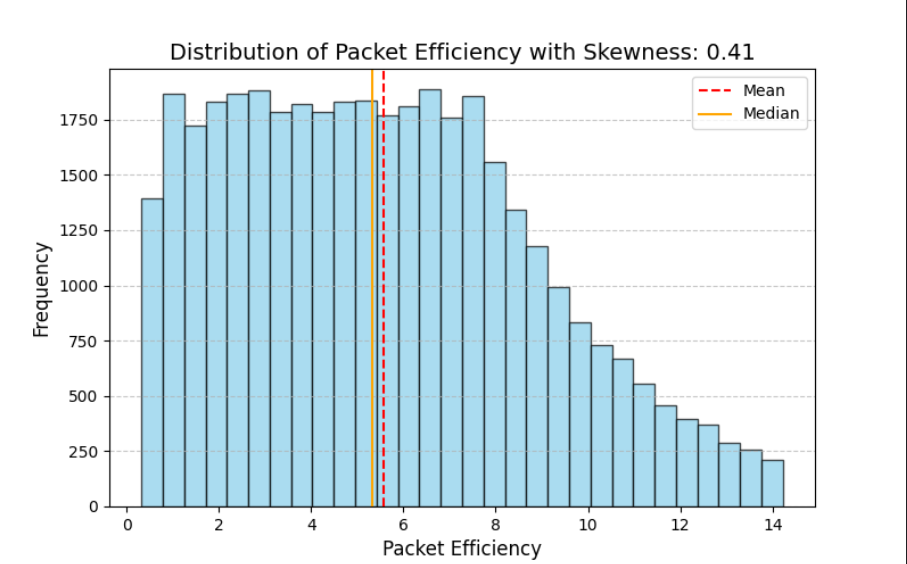

# Data Visualization: Cybersecurity Attacks

## Project Information
- Institution: University of Pristina "Hasan Prishtina"
- Program: Master's Degree, Computer and Software Engineering
- Subject: Preparation and Data Visualization       
- Professor: Dr. Sc. Mërgim H. HOTI
  

  <div align="center">
  
</div>

## Authors

- [Albin Hashani](https://github.com/AlbinHashanii)
- [Arjana Tërnava](https://github.com/ArjanaaTernava)
- [Erza Osmani](https://github.com/erzaosmani)

## First Phase

The first phase of the project involves preprocessing data related to cybersecurity attacks to prepare it for further analysis. 
The preprocessing steps include:

- Data collection
- Integration
- Aggregation
- Data cleaning
- Discretization
- Binarization
- Transformation
- Dimensionality reduction
- Feature subset selection

## Development Environment

- Editor: PyCharm


- Instructions:
    - Download and install PyCharm Editor
    - Select Pure Python for the project type
    - If you don't have an interpreter set up, you can do it in the editor based on instructions.
    - Install the required packages

  - Results of the first phase: 

    - Data Collection
      ```bash
      csv_data = pd.read_csv("cybersecurity_attacks.csv")

      ```
      - The dataset file `cybersecurity_attacks.csv` should be located in the directory: `cybersecurity-attacks-data-visualization/src`.

    - Load dataset 
      ```bash
      csv_data = pd.read_csv("cybersecurity_attacks.csv")
      ``` 
    - Printing Data Types
      
       
      
    - Summary statistics for numerical columns
      
      

    - Aggregation Functions - mean, count, min, max
      
      
      
    - Missing values
      
      
      
    - Duplicate values
   
      
      
    - Discretization - The code applies binning to different numeric columns `Source Port`, `Destination Port`, `Packet Length`, `Anomaly Scores`, `Source IP Address`, `Destination IP Address`, using labels:
      
       

    - Binarization of the fields: `Packet Type` and `Log Source` using values 0 and 1.
      
       

    - Dimensionality reduction - We applied Principal Component Analysis (PCA) to reduce the dataset to two principal components, capturing the most important features while simplifying the data structure. The numerical columns are also standardized.
      
      
      
      
      
      
      
    - Chi Square Test Results - Target: Attack Type
      
      

      
## Second Phase

The second phase of the project focuses on identifying outliers and eliminating inaccurate findings within the dataset.
These steps include:
- Outlier detection
- Elimination of inaccurate discoveries
- Data exploration
- Results of the second phase:
  
  - Skewness data before removing outliers:
    
    
    
    
    
    
    
    
    
    
    
    
    
  - Skewness data after removing outliers:
    
       
    
       
    
       
    
  - Correlation Matrix
    
      
    

- The new cleaned dataset `cleaned_data.csv` should be located in the directory: `cybersecurity-attacks-data-visualization/src`.


### License

[Apache-2.0](http://www.apache.org/licenses/)


